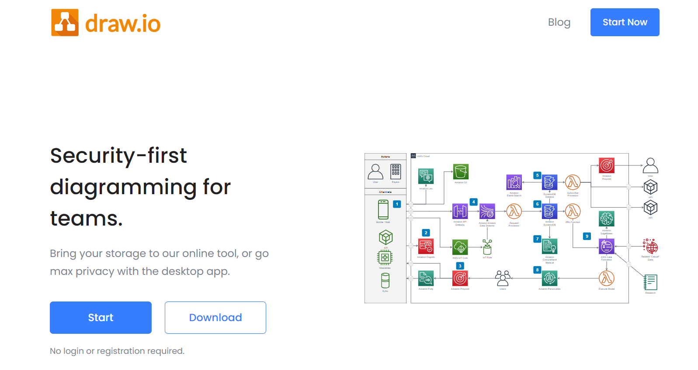

{: .no_toc }

# Tools and Platforms

There are a number of diagram software packages and platforms, ideally you need to pick one you are comfortable using or fits in with your organisation. Ideally picking one that can create diagrams by scripting which will help the process be less awkward and time consuming.

You can also get Live Editor platforms such as Mermaid and use AI to help you scaffold the basic structure using prompts in ChatGTP plus plugins for editors such as VS Code.

Draw.io can be used online or as a downloaded app on Mc or PC and you can link to GitHub

[drawio.com/blog](https://www.drawio.com/blog)

### Mermaid

JavaScript based diagramming and charting tool that renders Markdown-inspired text definitions to create and modify diagrams dynamically.

[mermaid.js.org/](https://mermaid.js.org/)

With Mermaid you can script your diagrams from scratch or use a template. It is a paid app (online()), but has a limited free tier.

There is a good help section to learn the scripting

But might be best to use with the VScode Mermaid Plug-in 

