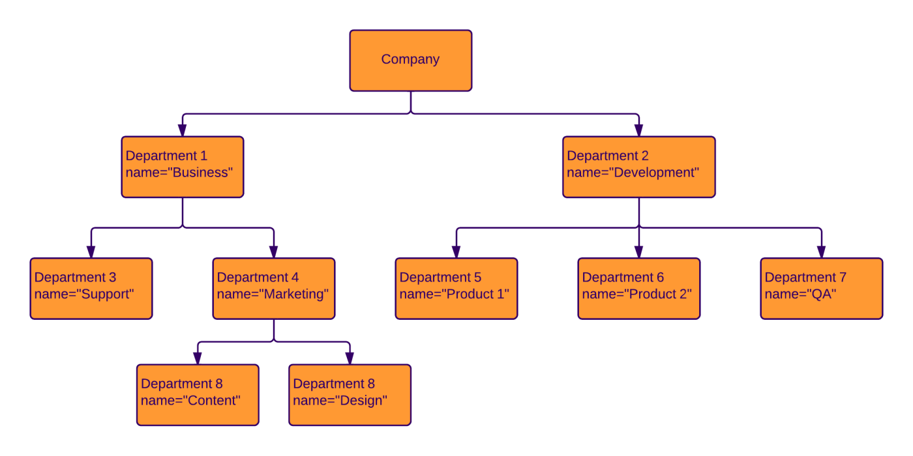
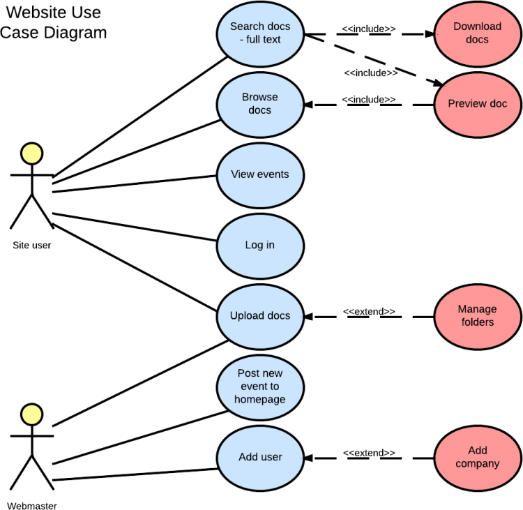
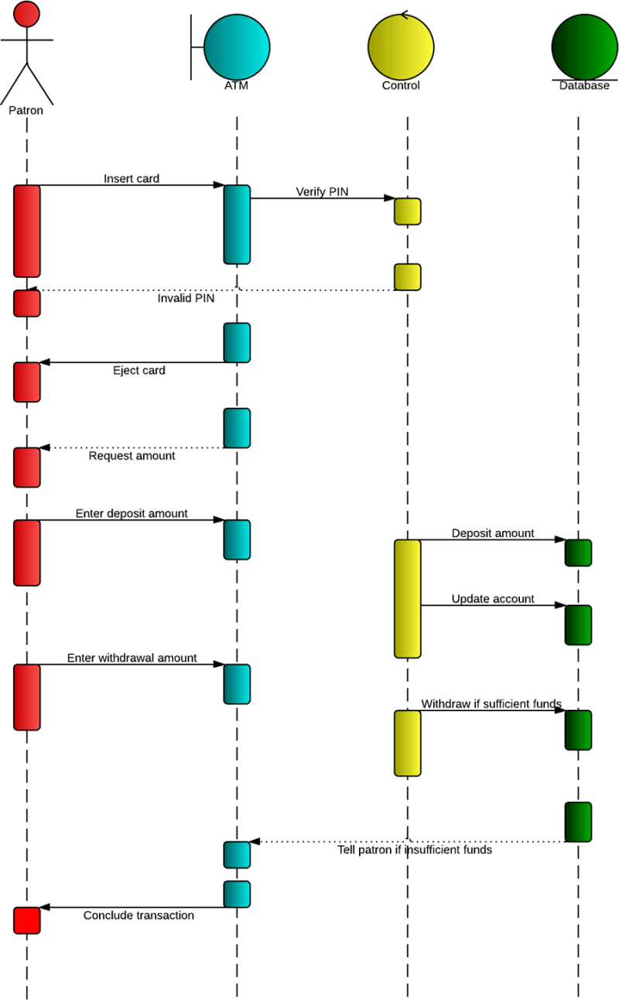
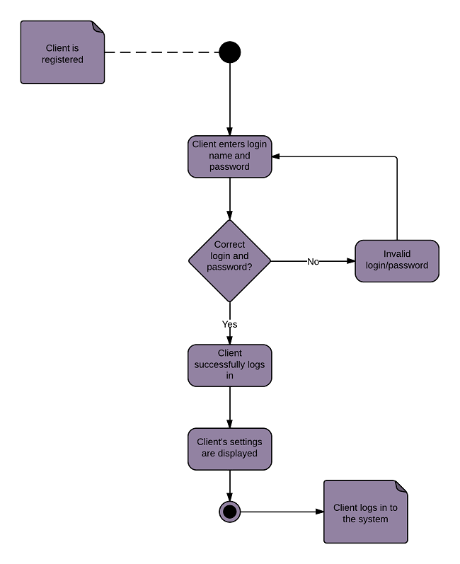
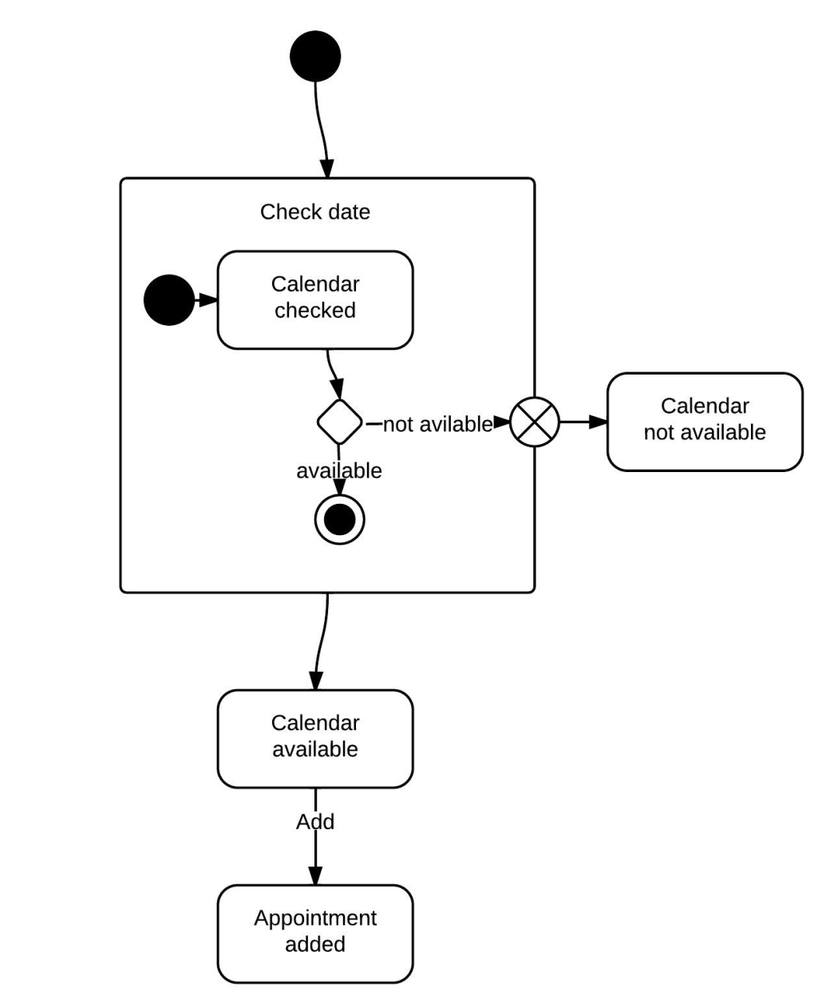
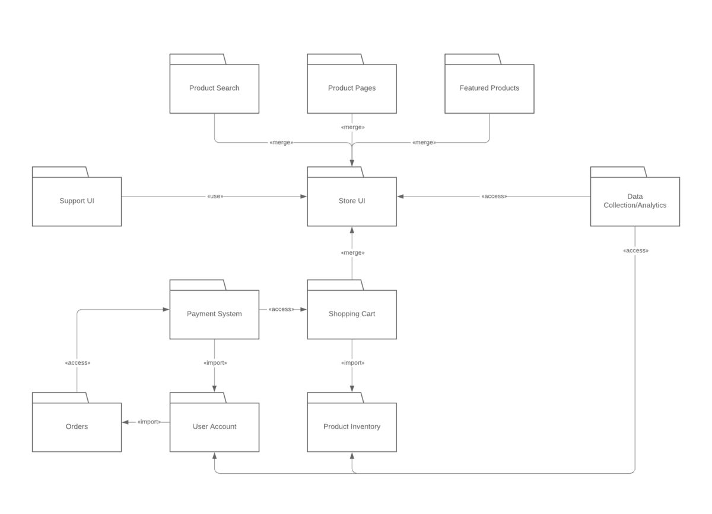
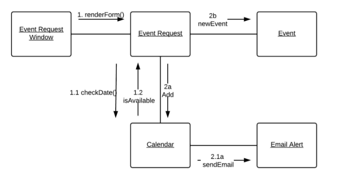
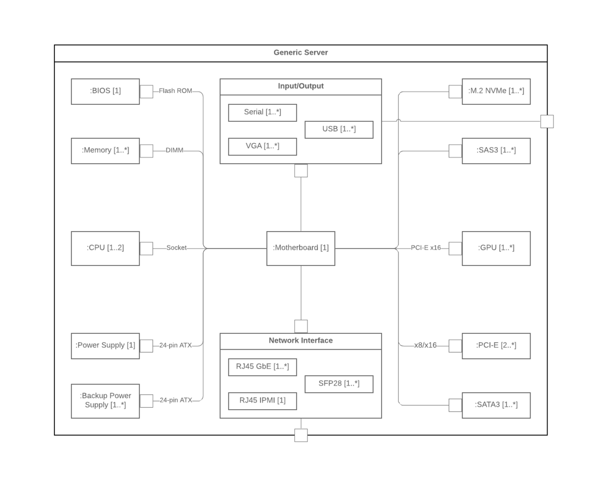

{: .no_toc }

# Unified Modelling Language (UML) Types

 Unified Modelling Language (UML) is a standardized visual modelling language used in software engineering to describe, specify, visualise, and document the structure and behaviour of a system. UML provides a variety of diagram types to represent different aspects of a system. Here are some commonly used UML diagram types:
 

## 1. Class Diagram

Represents the static structure of a system by showing classes, attributes, operations, relationships, and their associations.

VISUAL PARADIGM, 2019. _UML Class Diagram Tutorial_ Available from: [https://www.visual-paradigm.com/guide/uml-unified-modeling-language/uml-class-diagram-tutorial/](https://www.visual-paradigm.com/guide/uml-unified-modeling-language/uml-class-diagram-tutorial/)

## 2. Object Diagram: 

Depicts instances of classes and their relationships at a specific point in time. It shows the objects and their attributes and associations.

LUCIDCHART, 2023. Object Diagram Tutorial [viewed 30 May 2023]. Available from: [https://www.lucidchart.com/pages/uml-object-diagram](https://www.lucidchart.com/pages/uml-object-diagram)

## 3. Use Case Diagram

Illustrates the functional requirements of a system by showing actors, use cases, and their relationships. It represents the interactions between the system and external entities.

 LUCIDCHART, 2019. UML Use Case Diagram Tutorial | Lucidchart [viewed 30 May 2023]. Available from: [https://www.lucidchart.com/pages/uml-use-case-diagram](https://www.lucidchart.com/pages/uml-use-case-diagram)

## 4. Sequence Diagram

Shows the interactions between objects in a sequential manner over time. It emphasizes the time ordering of messages exchanged between objects.

 LUCIDCHART, 2019b. UML Sequence Diagram Tutorial [viewed 30 May 2023]. Available from: [https://www.lucidchart.com/pages/uml-sequence-diagram](https://www.lucidchart.com/pages/uml-sequence-diagram)

 

## 5. Activity Diagram

Represents the workflow or flow of activities in a system. It describes the dynamic behaviour of a system by showing the control flow, decisions, concurrency, and loops.

 LUCIDCHART, 2023b. UML Activity Diagram Tutorial [viewed 30 May 2023]. Available from: [https://www.lucidchart.com/pages/uml-activity-diagram](https://www.lucidchart.com/pages/uml-activity-diagram)

## 5. State Machine Diagram

Models the behaviour of an object or a system by representing the states, events, and transitions between states. It describes the possible sequences of states and their responses to events.

 LUCIDCHART, 2023c. State Machine Diagram Tutorial [viewed 30 May 2023]. Available from: [https://www.lucidchart.com/pages/uml-state-machine-diagram](https://www.lucidchart.com/pages/uml-state-machine-diagram)

 

## 5. Component Diagram

Depicts the organization and dependencies of software components in a system. It shows the high-level structure of a system and the interfaces between components.

 LUCIDCHART, 2019c. Component Diagram Tutorial [viewed 30 May 2023]. Available from: [https://www.lucidchart.com/pages/uml-component-diagram](https://www.lucidchart.com/pages/uml-component-diagram)

## 6. Deployment Diagram

Represents the physical deployment of software components on hardware nodes. It illustrates the hardware infrastructure and the distribution of components across nodes.

LUCIDCHART, 2023d. Deployment Diagram Tutorial [viewed 30 May 2023]. Available from: [https://www.lucidchart.com/pages/uml-deployment-diagram](https://www.lucidchart.com/pages/uml-deployment-diagram)

 

## 7. Package Diagram

Shows the organization and dependencies of packages or namespaces in a system. It provides a high-level view of the modular structure of a system.

 LUCIDCHART, 2023e. Package Diagram Tutorial [viewed 30 May 2023]. Available from: [https://www.lucidchart.com/pages/uml-package-diagram](https://www.lucidchart.com/pages/uml-package-diagram)

 

## 8. Communication Diagram

Like a sequence diagram, it focuses on the interactions between objects but emphasizes the relationships between objects rather than the time ordering of messages.

 LUCIDCHART, 2023f. Communication Diagram Tutorial [viewed 30 May 2023]. Available from: [https://www.lucidchart.com/pages/uml-communication-diagram](https://www.lucidchart.com/pages/uml-communication-diagram)

## 9. Composite Structure Diagram

Describes the internal structure and collaborations of a class or component. It shows the structure and relationships between parts, ports, connectors, and other internal elements.

 LUCIDCHART, 2023g. Composite Structure Diagram Tutorial [viewed 30 May 2023]. Available from: [https://www.lucidchart.com/pages/uml-composite-structure-diagram](https://www.lucidchart.com/pages/uml-composite-structure-diagram)

T
