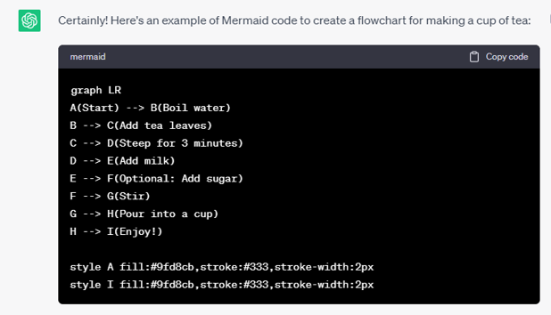
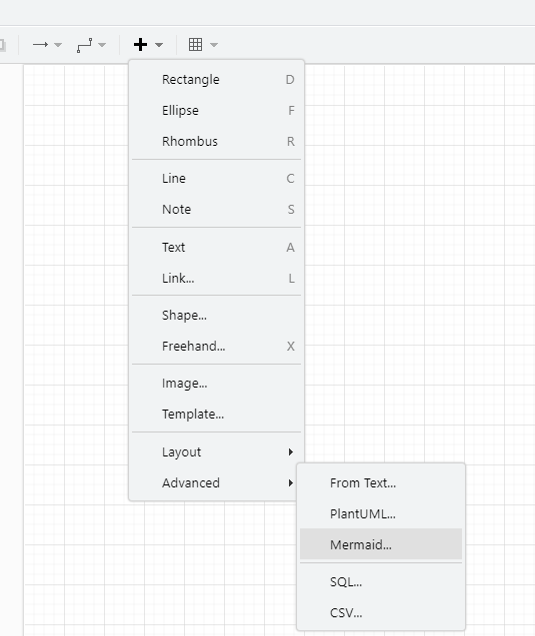
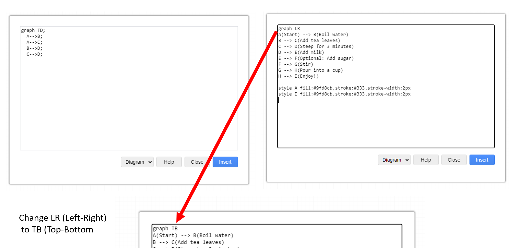
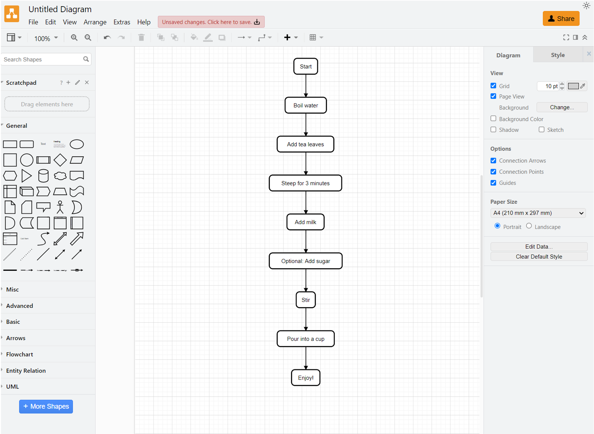

{: .no_toc }

# Prompts

This task is for going from AI to draw-io (diagams-net)

**Try these prompts on AI platform:**

Example Prompts:

**Prompt:** Create Mermaid code for Restaurant management system flow diagram.

**Prompt:** Create Mermaid code for Restaurant management system class diagram.

Play around with the following - more info can be found in [Mermaid Docs](https://mermaid.js.org/intro/)

* online shopping system.
* social media platform.
* banking system.
* car rental management system.
* hotel reservation system.
* ticket booking system for an amusement park.
* music streaming application.
* e-learning platform.
* customer relationship management (CRM) system.how
* Restaurant management system flow diagram.

Remember, these prompts serve as starting points to generate UML diagrams. You can further customise the prompts based on specific requirements, functionalities, or additional features to make them more tailored to your learning objectives - such as Design a UML flow diagram for a restaurant management system and now create Mermaid code for this which then can be copied and pasted into Mermaid or Draw.io

### Walkthrough - AI to Draw-io
We will go to an AI platform and prompt it to make Mermaid code for a Flow Chart to make a cup of tea

Copy the Mermaid code from ChatGTP aand go to [Draw.io](https://app.diagrams.net/) Click on the `+` icon and select Mermaid

Delete the defualt text in the editor and paste in the ChatGPT generated code. Chat the Graph TB (Top )

Click Insert

