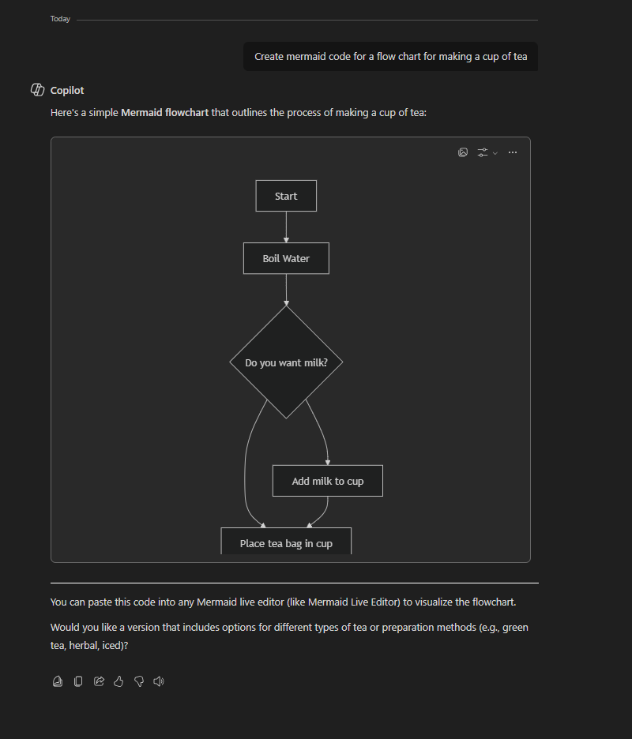
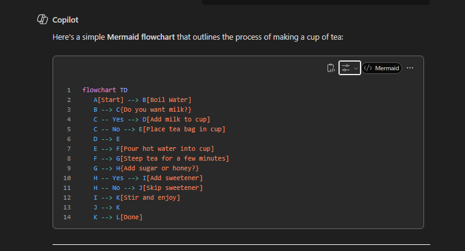
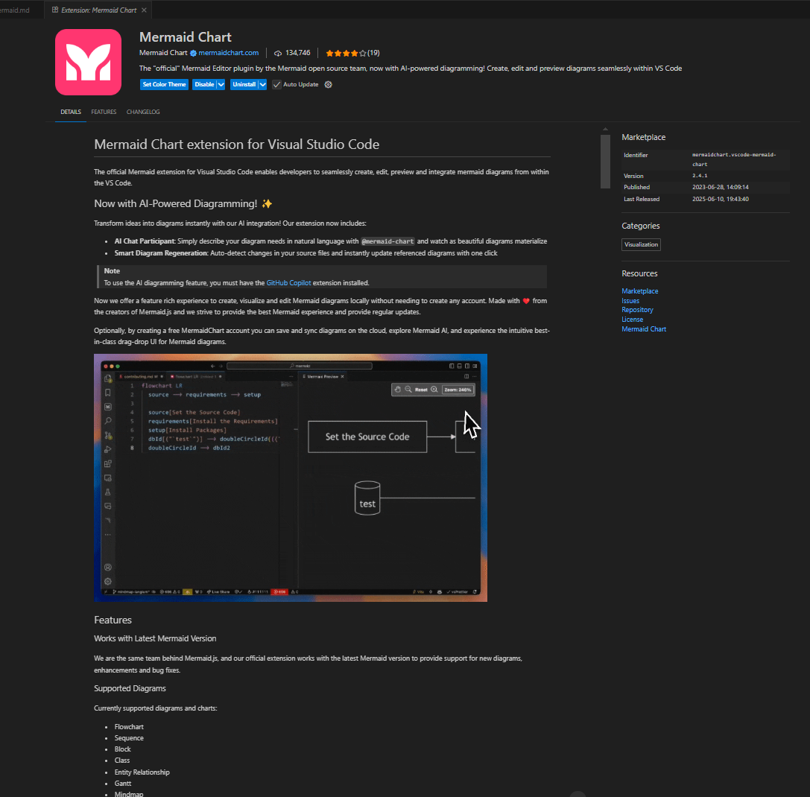
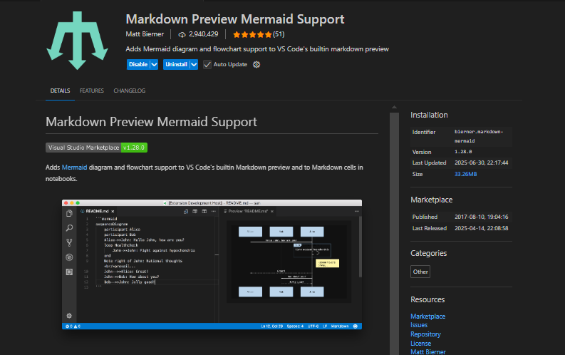
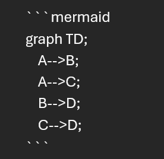
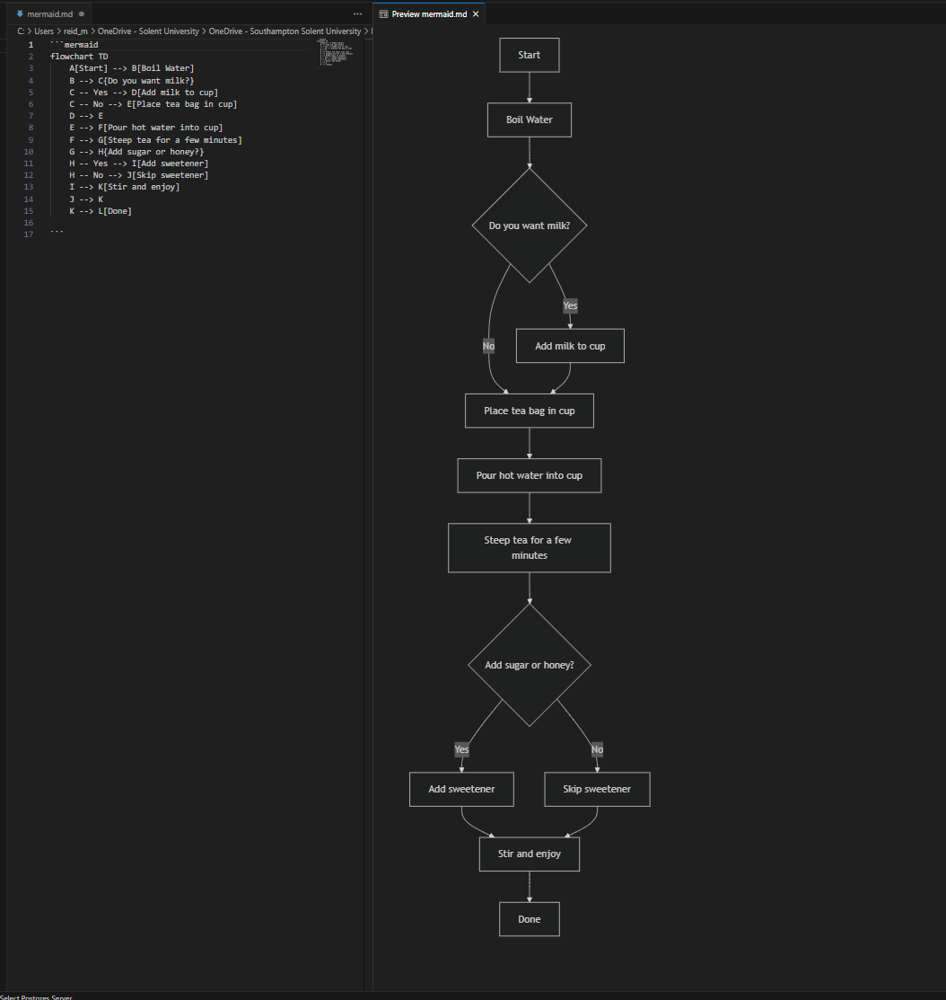
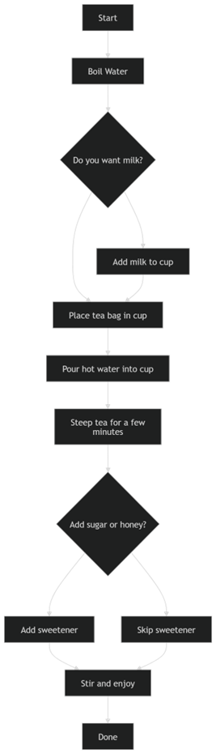

{: .no_toc }

# Mermaid & VS Code 

On an AI platform ask to generate:

```
Create mermaid code for a flow chart for making a cup of tea
```



Toggle to show code and then copy 



Here is the Copied Code:

```
 flowchart TD
    A[Start] --> B[Boil Water]
    B --> C{Do you want milk?}
    C -- Yes --> D[Add milk to cup]
    C -- No --> E[Place tea bag in cup]
    D --> E
    E --> F[Pour hot water into cup]
    F --> G[Steep tea for a few minutes]
    G --> H{Add sugar or honey?}
    H -- Yes --> I[Add sweetener]
    H -- No --> J[Skip sweetener]
    I --> K[Stir and enjoy]
    J --> K
    K --> L[Done] 

```


In VS Code intall Mermaid Chart exstension



and Markdown Preview Mermaid Support - there are other so try thnem too



**Cut and paste into VS Code**

You will need to create mermaid diagrams in markdown using mermaid fenced code blocks:




Switch on preview panel - You can now edit your diagram programmatically



Completed diagram


